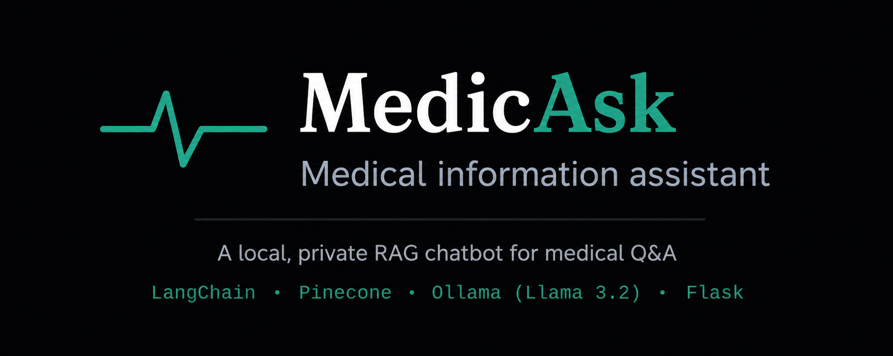

<h1 align="center"> MedicAsk A Private RAG Assistant You Run Yourself </h1>


<p align="center">
  
</p>
</p>


<p align="center">
  <strong>An AI-powered Retrieval-Augmented Generation (RAG) medical assistant built with LangChain, Pinecone, Ollama, and Flask.</strong>
</p>

<p align="center">
  Grounded answers • Local inference • Source citations • Context-aware conversations
</p>

<p align="center">
 <p align="center">
  
  
  
  
  
  
  
  
</p>
</p>


##  Overview

MedicAsk is a retrieval-augmented generation (RAG) chatbot that answers medical questions grounded in a curated reference document, using a fully local inference pipeline  no external API calls, no per-query cost, and no data leaving the machine it runs on.

Ask a question, get an answer sourced from an indexed medical reference PDF, with follow-up questions understood in context (e.g. "what is Hanta-Virus?" → "what is the cause?" is correctly understood as still being about Hanta-Virus).

----


<p align = "center">
  
### Video Walkthrough

https://1drv.ms/u/c/726f4b95e54d4da2/IQCczC6P2tFGSJWo9FoFxNwoARbmCmTd9QSbaOY5xd5vWl0?e=FmRYib
</p>


### Application Screenshots

| | |
|---|---|
|  |  |
| **Grounded answer with source citation** | **Live token-by-token streaming** |
|  |  |
| **Persistent conversation history** | **History-aware follow-up questions** |

---
#  System Architecture

<p align="center">
    
</p>

---

# 1. How It Works 🩺⚙️

At a high level, MedicAsk is a Retrieval-Augmented Generation (RAG) application that grounds every response in an indexed medical reference document. Instead of relying solely on a language model's internal knowledge, the system retrieves the most relevant information from a curated knowledge base before generating an answer.

## 1.1 The Knowledge Base

Before users can interact with the assistant, the source PDF documents are processed through an ingestion pipeline.

**Chunking**

Each document is divided into smaller overlapping text chunks (~500 characters). Overlapping chunks help preserve context across section boundaries and improve retrieval quality.

**Embedding**

Each chunk is converted into a high-dimensional vector representation using the **all-MiniLM-L6-v2** sentence transformer from Hugging Face. This allows the system to search by semantic meaning rather than exact keyword matches.

**Storage**

The generated embeddings are stored in a Pinecone vector database together with metadata identifying their source document. This preprocessing only needs to be performed once for each document.

---

## 1.2 Semantic Retrieval

When a user submits a question, MedicAsk embeds the query using the same embedding model and performs a similarity search against the Pinecone index.

Instead of scanning the entire document, the retriever returns only the most semantically relevant chunks, which become the context supplied to the language model.

This allows the assistant to answer based on evidence rather than memory.

---

## 1.3 History-Aware Question Rewriting

Many conversations contain follow-up questions that depend on previous messages.

For example:

> **User:** What is AIDS?  
> **User:** What is the cause?

The second question is ambiguous on its own.

Before retrieval takes place, LangChain uses the local LLM to rewrite follow-up questions into standalone questions using the conversation history.

The previous example becomes:

> *"What is the cause of AIDS?"*

This rewritten query produces significantly more accurate retrieval results while remaining invisible to the user.

---

## 1.4 Response Generation

After retrieval, the relevant document chunks are combined with the rewritten question and sent to **Llama 3.2**, running locally through Ollama.

The model is instructed to:

- Answer only using the retrieved context.
- Avoid fabricating information.
- Clearly acknowledge when the answer cannot be found.
- Encourage users to consult qualified healthcare professionals for medical advice.

Responses are streamed to the interface token-by-token using Server-Sent Events (SSE), allowing users to begin reading before generation has completed.

---

## 1.5 Complete Request Pipeline

Every question follows the same workflow:

1. The user submits a question.
2. The conversation history is analysed.
3. Follow-up questions are rewritten into standalone queries.
4. The rewritten question is embedded.
5. Pinecone retrieves the most relevant document chunks.
6. The retrieved context is passed to Llama 3.2.
7. The response is streamed back to the browser.
8. The conversation is saved locally for future context.

---

# 2. Why Retrieval-Augmented Generation? 💡

Traditional language models generate responses from patterns learned during training. While powerful, they may confidently produce incorrect or outdated information.

Retrieval-Augmented Generation (RAG) addresses this limitation by grounding every answer in an external knowledge source before generation.

For MedicAsk, this provides several important advantages:

- **Evidence-based responses** grounded in indexed reference material.
- **Reduced hallucinations** by limiting answers to retrieved context.
- **Source transparency**, allowing users to understand where information originated.
- **Easily expandable knowledge**, as new PDFs can be indexed without retraining the model.

This architecture makes the assistant considerably more reliable for educational medical question answering than relying solely on a standalone language model.

---

# 3. Why Run the Model Locally? 🖥️

Instead of calling a hosted AI API, MedicAsk uses **Ollama** to run **Llama 3.2** directly on the user's machine.

Running locally offers several advantages:

- No API costs.
- No rate limits.
- No internet connection required after setup.
- User questions remain on the local machine.
- Full control over the inference process.

The primary trade-off is slower inference on CPU-only systems compared to cloud-hosted GPUs. To improve the user experience, responses are streamed incrementally as they are generated.

---

# 4. Example Questions

MedicAsk supports a variety of medical information requests.

### General Medical Information

- What is hypertension?
- What causes diabetes?
- What are the symptoms of pneumonia?

### Contextual Follow-up Questions

- What is AIDS?
- What is the cause?
- Is there a cure?
- How is it treated?

### Treatment Questions

- What are the treatment options for Hantavirus?
- How is asthma managed?

### Out-of-Scope Questions

If information is not contained within the indexed documents, MedicAsk does **not** fabricate an answer. Instead, it clearly informs the user that the requested information is unavailable.

---

# 5. Known Limitations ⚠️

Although MedicAsk demonstrates a complete Retrieval-Augmented Generation pipeline, it has several practical limitations.

- Response speed depends on local hardware.
- CPU-only inference is slower than GPU acceleration.
- Conversation history is stored locally without user authentication.
- Answer quality depends entirely on the indexed reference documents.
- The application is intended for educational and portfolio purposes and is **not** a diagnostic or clinical decision-making tool.

Every response reminds users to seek advice from qualified healthcare professionals for medical concerns and to contact emergency services in urgent situations.

---

# 6. Getting Started 🚀

## Prerequisites

- Python 3.12
- Ollama installed
- Llama 3.2 pulled locally

```bash
ollama pull llama3.2
```

- Pinecone account
- Pinecone API key

---

## Installation

```bash
git clone <your-repository-url>

cd MedicAsk

python -m venv .venv312

# Windows
.venv312\Scripts\Activate.ps1

pip install -r requirements.txt
```

Create a `.env` file in the project root:

```env
PINECONE_API_KEY=your_api_key_here
```

---

## Running the Project

Create the Pinecone index:

```bash
python create_index.py
```

Index a PDF document:

```bash
python add_pdf.py "Data/medical_reference.pdf"
```

Run the application:

```bash
python app.py
```

Open your browser and navigate to:

```
http://127.0.0.1:5000
```

---


https://github.com/user-attachments/assets/e01869d9-c47c-4e7a-b427-83c7717cf1a2


# 7. Technology Stack

| Component | Technology | Purpose |
|-----------|------------|---------|
| LLM | Llama 3.2 (Ollama) | Local response generation |
| Embeddings | all-MiniLM-L6-v2 | Semantic document embeddings |
| Vector Database | Pinecone | Semantic retrieval |
| Framework | LangChain | RAG orchestration |
| Backend | Flask | Web server and streaming |
| Frontend | HTML, CSS, JavaScript | User interface |
| Streaming | Server-Sent Events (SSE) | Live response generation |

---

# 8. Design Decisions & Challenges

Developing MedicAsk involved solving several real-world engineering challenges, including:

- Managing Python environment inconsistencies.
- Recovering from an accidentally exposed API key.
- Debugging LangChain chain configuration issues.
- Improving follow-up question retrieval through history-aware rewriting.
- Optimising large PDF ingestion and indexing performance.

A more detailed discussion of these challenges is available in:

```
docs/TROUBLESHOOTING.md
```

---

# 9. Future Improvements

Potential enhancements include:

- Multi-query retrieval for complex questions.
- GPU acceleration for faster inference.
- Support for multiple indexed document collections.
- User authentication and secure conversation management.
- Docker deployment.
- Automatic document upload through the web interface.
- Hybrid keyword + semantic search.
- Support for additional document formats such as Word and Markdown.

---

# Disclaimer

MedicAsk is an educational software engineering project demonstrating the implementation of a Retrieval-Augmented Generation (RAG) pipeline using modern AI technologies.

It is **not** intended to diagnose, treat, cure, or prevent any medical condition. Users should always consult qualified healthcare professionals for medical advice and seek emergency services in urgent situations.
